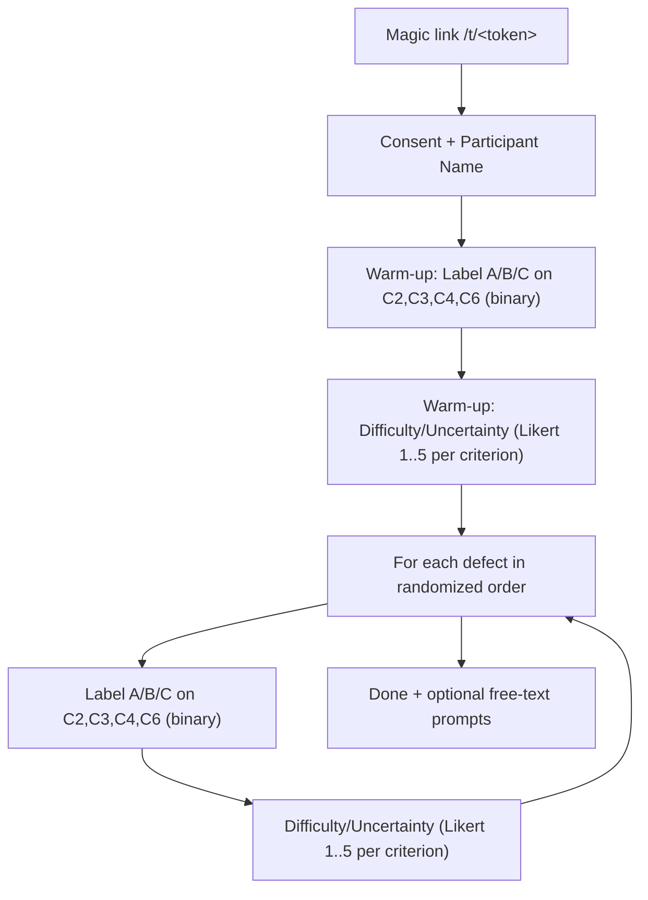

# User Study Methodology (RQ2) — Operational Documentation

This document describes the **exact, implemented methodology** of the RQ2 user study as executed by the minimal web
application in this folder (`user_study/`). It is written as “thesis-ready” methodology notes: what participants see,
what they do, how stimuli are constructed, how randomization works, and what data is recorded.

If you need to cite the implementation, the authoritative sources are:
- Study flow + saving logic: `user_study/app/main.py`
- Criteria wording shown to participants: `user_study/app/study_data.py`
- Screens shown to participants: `user_study/app/templates/*.html`
- Stimuli (root-cause descriptions + explanations): `user_study/ground_truth.json` and `user_study/stimuli/defect*_py_BASELINE_run*.txt`

---

## 1) Purpose and study object

**Goal (RQ2):** collect human judgments of *LLM-generated explanations of software failures*.

**Unit of evaluation:** an explanation text for a specific defect. For each defect, there are **three explanations**
(labeled to the participant as **A / B / C**).

**What participants judge:** explanations are judged on four criteria (**C2, C3, C4, C6**) using **binary labels** (pass
vs. fail), plus **difficulty/uncertainty ratings** about the judging process.

---

## 2) Study materials (stimuli)

### 2.1 Defects

The study contains **8 Python defects** (IDs `defect1_py` … `defect8_py`). Each defect corresponds to a failing function
and an associated failing test (origin: Python translations of Defects4J-based materials; see `src/data.py` in the main
project).

The *exact* defect snapshot used by the study is stored in:
- `user_study/ground_truth.json`

For each defect, `ground_truth.json` provides:
- `id` (e.g., `defect4_py`)
- `source_path` (path to the buggy source file in the repo)
- `test_path` (path to the failing test in the repo)
- `function_name`
- `error` (test failure message)
- `ground_truth` (a short textual description of the root cause)

**Important:** the web app does *not* show the full source code or tests to participants. The app primarily shows the
`ground_truth` text (see §3.2).

### 2.2 Root-cause description shown to participants

For each defect, participants are shown the defect’s **root-cause description** text from `ground_truth.json`, labeled in
the UI as **“Description of the code problem (after successful fixing)”**:
- On the **Label** page it is shown prominently under that heading.

This root-cause description text is used as the reference when judging whether an explanation identifies the correct root cause
(C2) and whether the causal chain is complete (C3).

### 2.3 Explanations

For each defect, the study provides **three explanation texts** (three independent runs). These are plain text files in
`user_study/stimuli/` and are loaded by filename pattern:
- `user_study/stimuli/defect{N}_py_BASELINE_run1.txt`
- `user_study/stimuli/defect{N}_py_BASELINE_run2.txt`
- `user_study/stimuli/defect{N}_py_BASELINE_run3.txt`

The app loads and displays these texts verbatim (no additional processing beyond templating).

#### Where the explanations come from (generation procedure)

These texts are generated *outside* the web app using the main pipeline and then copied into `user_study/stimuli/` as fixed
stimuli.

At generation time, explanations are produced by running the project’s pipeline for the **BASELINE** configuration:
- Pipeline entrypoint: `scripts/run_pipeline.py`
- Prompt construction: `src/experiment.py` (`Experiment.get_prompt`)
- Model access: `src/llm.py` (`LLMService`, default model `"gpt-5-mini"` unless overridden at runtime)

**Definition of BASELINE in this project:** “BASELINE” corresponds to including *all eight context levels* in the prompt:
`CODE`, `ERROR`, `TEST`, `DOCSTRING`, `SLICE_BLOCK`, `SLICE_BACKWARD`, `SLICE_FORWARD`, `SLICE_UNION`
(see `src/experiment.py:ContextLevel` and `Experiment.levels_to_string`).

Each defect has three baseline explanation samples because the pipeline was executed for **3 runs** (`run_id = 1..3`),
producing three independent generations for the same baseline context.

---

## 3) Study design (within the web app)

### 3.1 Access control (magic-link tokens)

Participants access the study via an **unguessable magic-link URL**:

`/t/<TOKEN>`

Tokens are generated with:
- `user_study/scripts/generate_tokens.py` (uses `secrets.token_urlsafe(32)`)

There is **no login** and the Cloud Run service is deployed `--allow-unauthenticated`; the token itself gates access.

### 3.2 What is shown on each defect page

For each defect, participants see:
- The defect identifier (e.g., `defect3_py`).
- The defect’s **description of the code problem (after successful fixing)** (label step).
- The three explanation texts, displayed side-by-side in a randomized order, labeled as:
  - “Explanation A”
  - “Explanation B”
  - “Explanation C”

Participants do *not* see:
- the code under `source_path`,
- the failing test under `test_path`,
- or the `error` string as a separate field.

Any code identifiers, line numbers, or error strings are only visible if they appear inside the explanation text or the
root-cause description text.

### 3.3 Study flow per participant (exact page sequence)

The study is implemented as a fixed sequence of pages, enforced by server-side completeness checks (see
`user_study/app/main.py:_next_url`).

At a high level:



#### Step 0 — Consent + participant name

The first page (`user_study/app/templates/consent.html`) describes the procedure and requires:
- A **Participant Name** (the UI asks to use the real name).
- An explicit “I consent to participate” checkbox.

Both are required to proceed.

#### Warm-up (practice)

After consent, participants complete a short **warm-up** consisting of:
1) **Warm-up Label** (binary labels for C2/C3/C4/C6 for explanations A/B/C)
2) **Warm-up Difficulty/Uncertainty** (Likert 1–5 for C2/C3/C4/C6)

Warm-up responses are **not saved**; only warm-up step completion is recorded so participants do not repeat it on refresh.

#### Step 1 — Labeling (binary per explanation × criterion)

For each defect, participants complete a **Label** page:
- They are shown the **description of the code problem (after successful fixing)**.
- They are shown the criteria definitions (see §4).
- For each explanation A/B/C and each criterion C2/C3/C4/C6, they select **Pass (1)** or **Fail (0)**.
- All labels are required to proceed (the form enforces completeness).

#### Step 2 — Difficulty / uncertainty ratings (Likert)

For each defect, after labeling, participants complete a **Difficulty / Uncertainty** page:
- For each criterion C2/C3/C4/C6, they rate how difficult/uncertain it felt to judge that criterion **for the current
  defect**, on a 5-point Likert scale (anchors below; see §4.2).
- All Likert answers are required to proceed.

#### Final step — Done + optional free-text prompts

After completing all defects, the study ends with:
- A confirmation that responses are saved.
- One **optional** free-text prompt:
  1) “How did you feel about judging explanations by each criterion? Any case that was particularly challenging, and why?”

This field can be left blank and saved optionally.

---

## 4) Measures and operationalization (exact wording)

This section documents the exact criteria wording and scales used in the web UI. The source of truth is
`user_study/app/study_data.py:CRITERIA` and `user_study/app/templates/likert.html`.

### 4.1 Binary criteria (C2, C3, C4, C6)

Participants provide **binary** judgments per explanation (A/B/C) per criterion:
- Pass = `1`
- Fail = `0`

Exact criteria as displayed:

**C2 — Problem Identification**
- “Score 1 if the explanation correctly identifies the ROOT CAUSE.”
- “Strict rejection: If it only restates the error message (symptom) without explaining WHY it happened, score 0.”

**C3 — Explanation Clarity**
- “Score 1 if the explanation provides a complete CAUSAL CHAIN.”
- “Strict rejection: The ‘Why’ must explicitly explain how the code logic led to the failure. If the explanation is
  circular, gaps exist, or it just says ‘it failed’, score 0.”

**C4 — Actionability**
- “Score 1 if the explanation provides a concrete, numbered list of steps (1., 2., 3.) that explicitly reference
  specific variable names, function names, or line numbers found in the code.”
- “Strict rejection: Score 0 for generic advice like ‘check the index’ or ‘fix the loop’ if specific identifiers are
  not mentioned.”

**C6 — Brevity**
- “Score 1 if the explanation is concise and information-dense (little repetition, mostly useful details).”
- “Score 0 if it is overly verbose/rambling OR too sparse to be useful.”

### 4.2 Difficulty / uncertainty Likert scale

For each defect, participants rate (per criterion) how difficult/uncertain it felt to judge:

1. Very easy/certain  
2. Easy  
3. Neutral  
4. Hard  
5. Very hard/uncertain

---

## 5) Randomization and counterbalancing (exact algorithm)

Randomization is **per participant token** and is implemented deterministically in `user_study/app/main.py`.

### 5.1 Deterministic seeding from token

The app derives a 32-bit seed from the token:
- `seed = int(sha256(token).hexdigest(), 16) % 2**32`

Then it uses Python’s `random.Random(seed)` for the main assignment shuffling (defect order and run→letter mapping).
Additional per-defect shuffles (e.g., displayed column order) use derived, token-dependent seeds (see §5.4).

**Why:** a participant’s assignment is stable (resume-safe) and reproducible from the token.

### 5.2 Defect order

Let `defect_ids` be the sorted list of defect IDs loaded from `ground_truth.json`.

The app shuffles `defect_ids` once per participant to obtain `assignment.defect_order`. Every participant completes all
8 defects, but in a different (token-dependent) order.

### 5.3 Mapping explanation runs → displayed letters (A/B/C)

For each defect independently:
- Start with `runs = [1, 2, 3]`
- Shuffle `runs`
- Assign in order to letters: `A, B, C`

This yields a per-defect mapping like:

```json
{
  "defect4_py": { "A": 1, "B": 3, "C": 2 }
}
```

Meaning: for defect4, “Explanation B” shown to the participant is actually `run3` for that defect.

**Consequence:** letter labels (A/B/C) do not correspond to a fixed run number, and the mapping differs by defect and by
participant.

### 5.4 Display order of explanations (A/B/C columns)

Independently of the run→letter mapping, the **visual order** of the explanation columns is randomized per participant
and per defect, while remaining stable for a given participant token (resume-safe). The resulting order is stored in
`assignment.explanation_order` as a list like `["C","A","B"]` per defect.

Algorithm (per defect):
- `seed = int(sha256(f"{token}|order|{defect_id}").hexdigest(), 16) % 2**32`
- `rng = random.Random(seed)`; shuffle `["A","B","C"]`

---

## 6) Data capture: what is stored, when it is stored, and where

### 6.1 When data is saved

The app saves state on each POST submission:
- consent
- identify (only used for edge cases; see `user_study/app/main.py`)
- warm-up label completion
- warm-up completion
- initial labeling per defect
- Likert per defect
- optional interview prompts at the end

This means partial progress is preserved and participants can resume.

### 6.2 Data model (merged participant state JSON)

The primary record is a **merged state** JSON containing:
- participant metadata
- assignment (defect order + explanation mapping)
- all responses
- app build metadata

This merged JSON is stored as a single file per participant token hash.

The schema is created in `user_study/app/main.py:_new_state` and normalized in `_normalize_state`.

Key fields (paths):
- `schema_version` (currently `2`)
- `participant.created_at`, `participant.last_updated_at`
- `participant.token_hash` (SHA-256 of the token; raw token is not stored as a filename)
- `participant.consent`, `participant.consented_at`
- `participant.participant_id` (participant name as entered)
- `participant.warmup_label_completed` (warm-up label step completion flag)
- `participant.warmup_completed` (warm-up completion flag)
- `assignment.defect_order` (list of defect IDs in the participant’s order)
- `assignment.explanation_map` (defect → letter → run_id)
- `assignment.explanation_order` (defect → list of letters in displayed column order)
- `responses.initial_labels` (defect → letter → criterion → 0/1)
- `responses.likert` (defect → criterion → 1..5)
- `responses.interview` (optional free text)
- `app.app_env`, `app.git_sha` (deployment metadata injected via env vars)

### 6.3 Audit log (append-only events)

In addition to the merged state, the app stores an append-only **audit trail** of events. Each event is a small JSON
object containing at least:
- `type` (event type)
- `ts` (UTC timestamp string)
- event payload (e.g., labels, participant_id)

Event types written by the app include:
- `consent`
- `identify`
- `warmup_label_complete`
- `warmup_complete`
- `label_initial`
- `likert`
- `interview`

### 6.4 Storage backends

The app supports two persistence modes (selected by environment variables; see `user_study/app/storage.py`):

**A) Cloud Run / GCS persistence (production)**
- Enabled when `GCS_BUCKET` is set.
- Merged state:
  - `gs://<bucket>/user_study/state/<sha256(token)>.json`
- Audit events:
  - `gs://<bucket>/user_study/audit/<sha256(token)>/<timestamp>_<nonce>_<event>.json`

**B) Local persistence (development)**
- Used when `GCS_BUCKET` is not set.
- Base directory:
  - `USER_STUDY_LOCAL_DIR` (default: `/tmp/user_study_data`)
- Merged state:
  - `<base>/state/<sha256(token)>.json`
- Audit events:
  - `<base>/audit/<sha256(token)>/<timestamp>_<nonce>_<event>.json`

---

## 7) Practical reproducibility notes

### 7.1 Running the study app locally

See `user_study/README.md` for the exact commands. In brief:
- install dependencies from `user_study/requirements.txt`
- run `uvicorn user_study.app.main:app --host 0.0.0.0 --port 8080`
- generate local tokens with `user_study/scripts/generate_tokens.py`

### 7.2 Exporting results from GCS

After the study, export all stored objects with:
- `user_study/scripts/export_gcs.py`

This downloads both merged participant states and the audit log.

### 7.3 Version tracking

The deployed app records build metadata into each participant state:
- `app.git_sha` (from env var `GIT_SHA`)
- `app.app_env` (from env var `APP_ENV`)

For thesis reporting, prefer using the values recorded in exported participant states to identify which deployment was
used for the data collection.

---

## 8) Methodological notes / limitations implied by the implementation

These are not “interpretations” of results; they are implementation facts that matter when writing the methodology:

1) **Root-cause description is shown before judging.** Participants see the “Description of the code problem (after successful fixing)”
   for each defect and then judge the explanations relative to it.

2) **No source code/test is shown in the UI.** Criteria (especially actionability, which requires “specific variable
   names, function names, or line numbers”) are judged from what is present in the explanation text (and what can be
   inferred from the root-cause description), not by verifying identifiers against code inside the interface.

3) **A warm-up task precedes the first defect.** Participants complete a practice labeling step and a practice
   difficulty/uncertainty step; warm-up responses are not saved (only completion is recorded).

4) **Explanation columns are randomized.** The displayed order of “Explanation A/B/C” varies by participant and defect.

5) **Participant name is collected.** The consent page requests a real name and stores it in the merged JSON state as
   `participant.participant_id`.

6) **No overall ranking is collected.** Participants do not rank explanations; only per-criterion binary labels and per-criterion
   difficulty/uncertainty ratings are collected.
